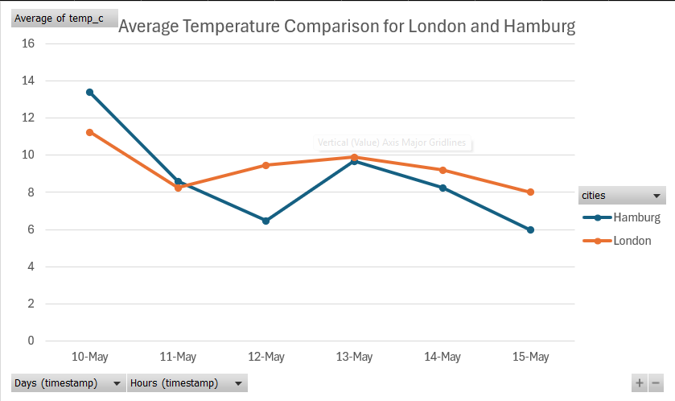
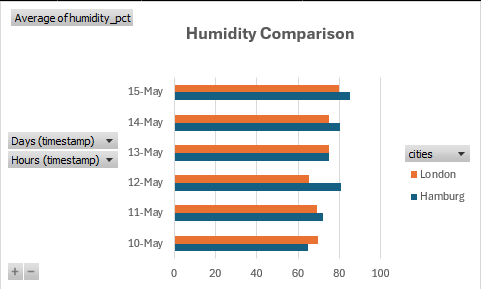
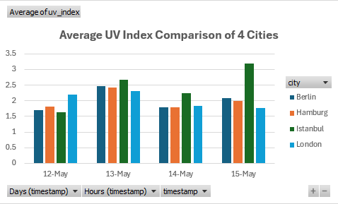

# AI-Driven Sentiment & Environmental Analytics 🚀

A multi-stream data pipeline that integrates real-time environmental logging with local AI-powered sentiment analysis of global news.

## 🌟 Project Overview
This repository contains two primary data engineering pipelines:
1. **Political Sentiment Engine**: Scrapes news archives from The Guardian and real-time headlines via NewsAPI, processing them through a **local Llama 3 instance** via Ollama to categorize global sentiment.
2. **Global Weather & UV Logger**: A persistent SQLite-backed service tracking atmospheric conditions across **Hamburg, London, Berlin, and Istanbul** to analyze regional climate trends and UV radiation levels.

## 🛠️ The Tech Stack
* **Language:** Python 3.14.4
* **Database:** SQLite3 (Relational storage with ACID compliance)
* **AI Engine:** Llama 3 (Inference via Ollama)
* **Data Engineering:** Pandas, CSV Serialization
* **Visualization:** Excel Pivot Tables & Power Query
* **Environment:** Secure `.env` management for API credentials

## 📊 Environmental Insights

### Temperature & Humidity Trends
Comparing the atmospheric stability of major European and Middle Eastern hubs.

### UV Radiation Analysis
Real-time monitoring of UV Index levels across different latitudes.

## 📁 Project Structure
* `scripts/`: Python logic for the Sentiment Engine and Environment Loggers.
* `images/`: High-resolution data visualizations and insights.
* `hamburg_data.db`: Local SQLite database (Note: listed in .gitignore for security).

## 🚀 How to Run
1. **Clone the repo:** `git clone https://github.com/vulevu228/AI-Weather-Sentiment.git`
2. **Install dependencies:** `pip install pandas requests python-dotenv`
3. **Setup Keys:** Rename `.env.example` to `.env` and add your API keys.
4. **Run the Logger:** `python scripts/environment_logger.py`
